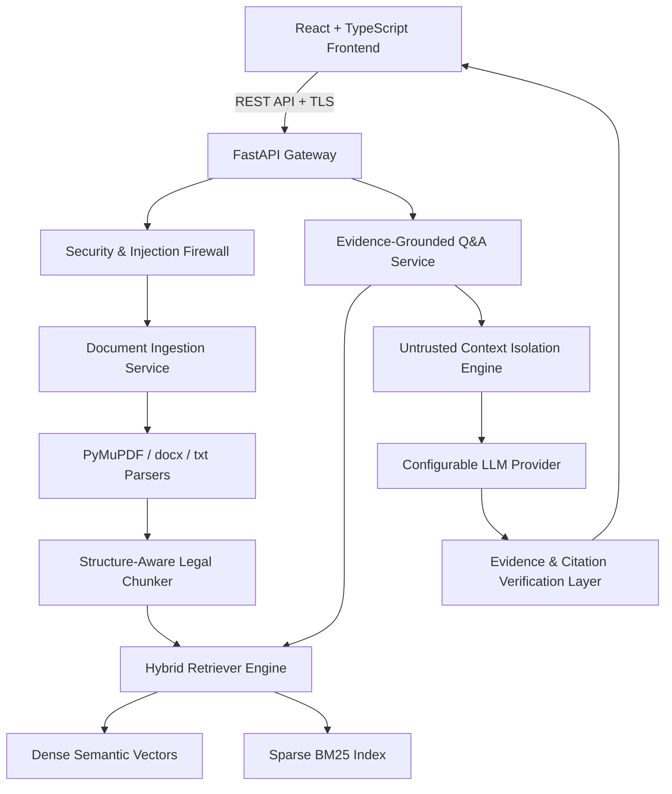

# NyayaLens Architecture & Technical Design

## 1. System Overview

NyayaLens is a production-grade, evidence-grounded Legal Document Intelligence platform designed to simplify complex legal documents, track obligations and restrictions, compare contract versions, and arm users with informed questions for legal counsel without claiming to replace professional legal advice.

### Non-Negotiable Core Principle
> **"Explain. Cite. Verify. Never pretend to be the lawyer."**

Every answer and synthesis generated by NyayaLens is grounded in verifiable provenance citations extracted from user-uploaded documents.

---

## 2. High-Level Architecture

---

## 3. The Evidence-Grounded Pipeline

Rather than dumping raw text into a model context, NyayaLens executes a rigorous multi-stage pipeline:

1. **Upload & Magic-Byte Validation**: Validates file size, file extensions, and magic byte signatures (`%PDF-`, `PK\x03\x04`). Filenames are normalized to prevent path traversal.
2. **Structure-Aware Legal Chunking**: Chunks text along contractual section/clause boundaries rather than arbitrary character cuts, preserving section headers, clause numbers, and character offsets.
3. **Hybrid Retrieval**: Combines semantic cosine similarity with BM25 Okapi keyword scoring, addressing legal terminology matching and conceptual queries.
4. **Untrusted Data Isolation**: Document context is treated as untrusted user data. Explicit prompt framing isolates document chunks from system directives, neutralizing prompt injection payloads.
5. **Post-Generation Citation Verification**: Model citations are fuzzy-matched against actual retrieved chunks. Hallucinated citations or ungrounded assertions are stripped or flagged as `insufficient_evidence`.

---

## 4. Legal Document Graph (LDG)

NyayaLens builds a lightweight, in-memory knowledge graph representation of the contract:

* **Nodes**: `Party`, `Clause`, `Obligation`, `Right`, `Deadline`, `Payment`, `Restriction`, `TerminationCondition`, `Document`.
* **Edges**: `HAS_OBLIGATION`, `HAS_RIGHT`, `APPLIES_TO`, `REQUIRES`, `TRIGGERS`, `EXPIRES_ON`, `PAYS`, `RESTRICTS`, `REFERENCES`.

---

## 5. Technology Stack Summary

* **Frontend**: React 18, TypeScript, Vite, Lucide Icons, Pure CSS Design System.
* **Backend**: Python 3.11+, FastAPI, Pydantic v2, Pydantic-Settings.
* **Parsing**: PyMuPDF (`fitz`), `python-docx`.
* **Retrieval & Math**: BM25 Okapi, NumPy, Semantic Hash Projections.
* **Testing & Quality**: pytest, pytest-asyncio, pytest-cov, ruff, mypy.
